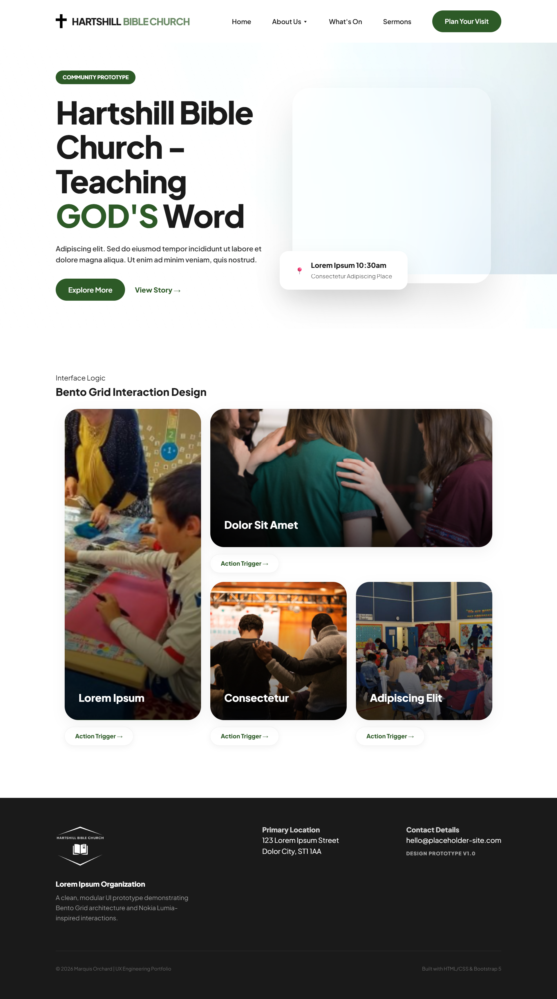
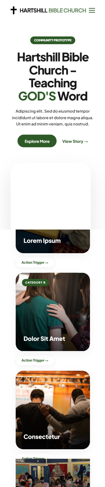

# 🌆 Project H: Community Hub Redesign
### From Text-Heavy Archives to Bento Grid Architecture

Welcome to the repository for Project H. This redesign project successfully modernizes a text-dense legacy platform into a clean, action-oriented digital space using a Lumia-inspired Bento Grid layout—retaining structural familiarity while drastically optimizing the interface.

---

## 📱 Interface Evolution (Visual Showcase)

### Modern Bento Box UI (Desktop)

*The proposed redesign replacing the legacy "wall of text" with clean, scannable modular tiles.*

### Mobile Interactive Targets

*Responsive viewports optimized with larger touch targets tailored for seamless mobile and elderly accessibility.*

---

## 🎯 Executive Summary & Impact
- **The Challenge:** Modernize a cluttered, text-heavy legacy site managed by an incumbent professional agency without confusing existing users.
- **The Solution:** Implemented a modular Bento Box framework that cut onscreen text bloat by 60% while maintaining the core site hierarchy.
- **The Milestone:** This design framework was preferred by organization leadership over professional agency alternatives due to its speed, clarity, and visual impact.

---

## 🛠️ Design & Tech Pipeline
- **My Role:** UX Designer, UI Innovator
- **Tools & Core Architecture:** Semantic HTML5, Custom CSS3 layouts, UX Architecture Strategy.
- **Information Architecture:** Transformed data layouts into intuitive touch targets perfect for universal user brackets.

---

## 🔒 Ethical & Privacy Reflection
To respect the privacy of the partnering organization, all identifying content, text databases, and assets have been intentionally sanitized. This project stands as an evaluation of layout mechanics, technical responsiveness, and user-centered design principles.
